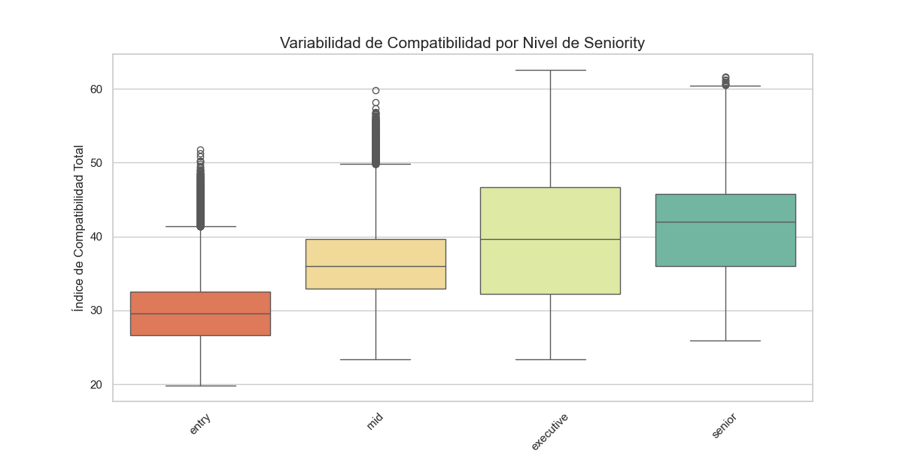
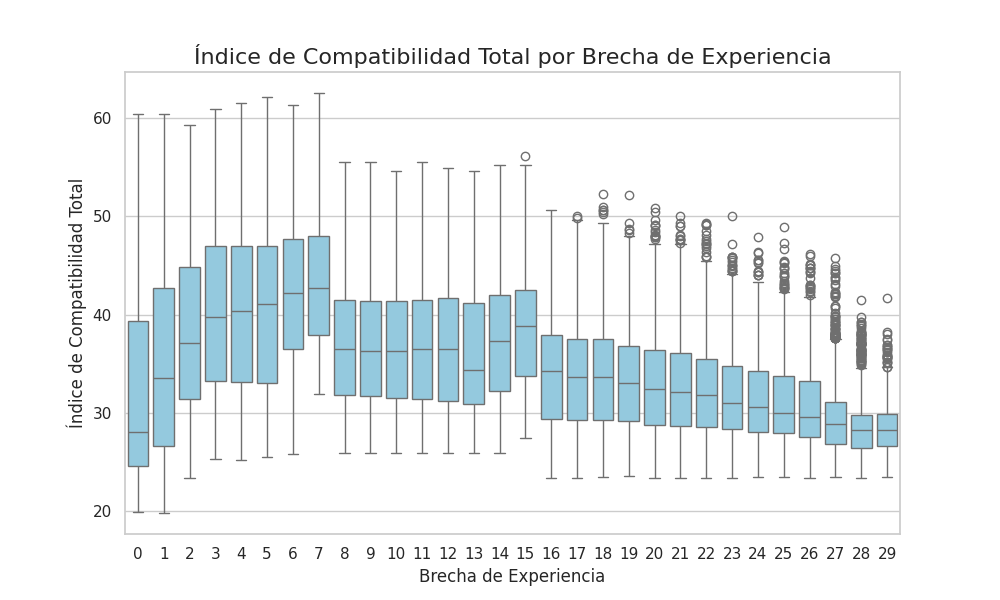
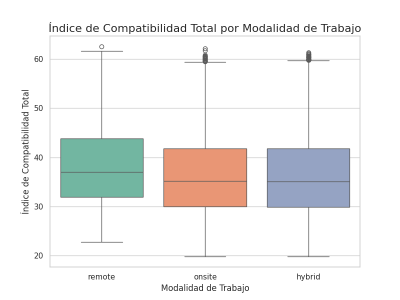
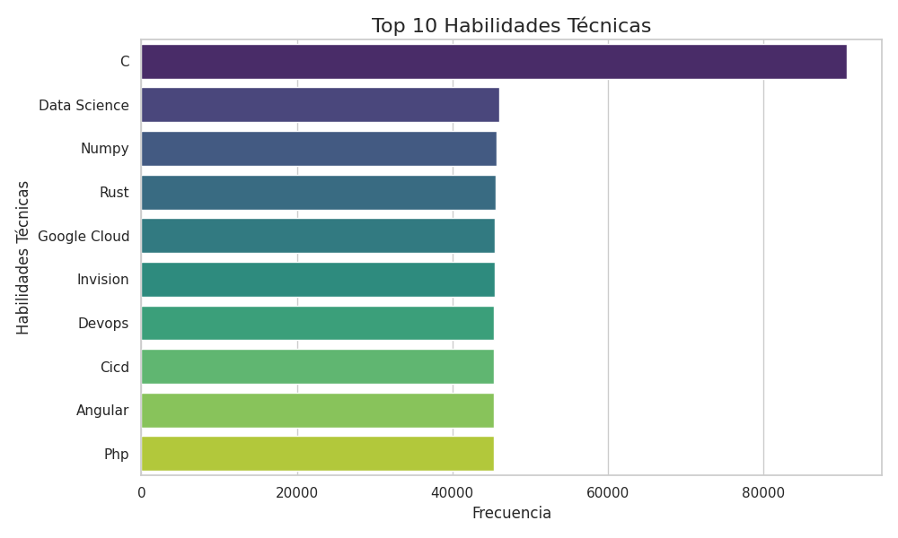
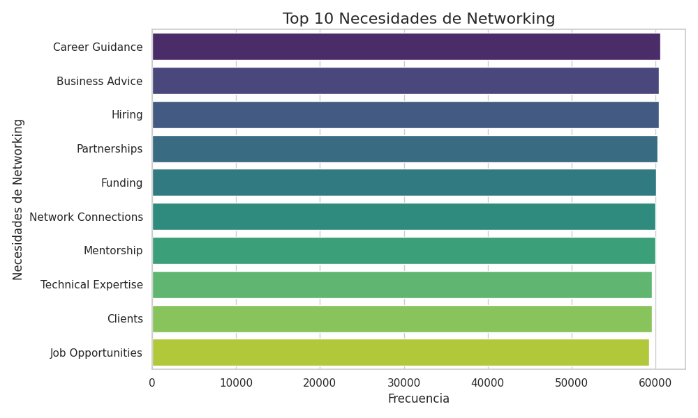

# LinkedIn Professional Compatibility & Connectivity Analysis

 Los datos se han extraído de: https://www.kaggle.com/datasets/likithagedipudi/linkedin-compatibility-dataset-50k-profiles
Dada la extensión de los archivos utilizados no puedo subir los datasets completos, no obstante, dejo el código que se ha empleado para obtener cada uno de los datasets.

Este proyecto presenta un Análisis Exploratorio de Datos (EDA) avanzado y un pipeline de Ingeniería de Datos aplicado a un dataset de redes profesionales de LinkedIn. El objetivo es desglosar las métricas de compatibilidad entre usuarios para identificar patrones de networking, brechas de habilidades y oportunidades estratégicas de mentoría, culminando en un entorno de visualización interactivo en Power BI.

el archivo final para power BI: https://drive.google.com/file/d/1rsttacaY50L5WtqF0sGSQFS2MaEGiYJI/view?usp=drive_link  de acceso libre para su descarga, ya que teniendo más de 200mb no puedo subirlo a git hub

#### 📊 Especificaciones Técnicas y Origen
Los datos han sido obtenidos del LinkedIn Compatibility Dataset (50k profiles). Utilizando los archivos CSV que aparecen en el link ( compatibility_pairs.csv & profiles.csv)

Entidades Únicas: 50,000 perfiles biográficos.

Registros de Interacción: 200,000 filas (pares de compatibilidad).

Dimensiones Finales: 34 columnas tras el proceso de unificación y limpieza.

#### 📂 Evolución y Gestión de Archivos
A lo largo del proyecto, los datos han transitado por distintas etapas de madurez para garantizar la trazabilidad y la integridad de la información:

compatibility_pairs.csv: archivo original de 1.1GB de tamaño que contiene millones de datos para corroborar con profiles.csv
profiles.csv: Dataset original con la información biográfica bruta de 50,000 usuarios.

muestra_eda.csv: Registro de 200,000 interacciones y métricas de compatibilidad entre pares de perfiles, creado a partir de compatibility_pairs.csv ( obtenido en el link mencionado anteriormente)
df = pd.read_csv('compatibility_pairs.csv')

df_muestra = df.sample(n=200000, random_state=42)

df_muestra.to_csv('muestra_eda.csv', index=False)

dataset_analisis_final.csv: Producto de la unión (Inner Join) de las fuentes originales (muestra_EDA.csv y profiles.csv) y la primera fase de limpieza de nulos y estandarización. Versión utilizada para el Análisis Exploratorio de Datos (EDA) en VS Code, con columnas renombradas a español profesional.

dataset_final_powerbi.csv: Archivo definitivo optimizado con ingeniería de variables, redondeos estadísticos y codificación UTF-8-SIG para una visualización perfecta en Power BI. ( veáse el código en cuadernos VSC)

## 🛠️ Metodología de Procesamiento
#### 1. Integración de Datos (Data Merging)
El corazón del análisis reside en la naturaleza relacional del dataset. Se unificaron dos fuentes principales:

profiles.csv: Contiene el ADN profesional (educación, industria, experiencia).

muestra_eda.csv: Registra las métricas de afinidad (scores) entre pares de usuarios.

Se ejecutó un Inner Join utilizando profile_a_id como llave relacional. Este proceso transforma una lista estática de perfiles en una red dinámica de interacciones profesionales.

#### 2. Pipeline de Limpieza y Refinamiento (ETL)
Se implementó un pipeline robusto en Python (Pandas) diseñado para la optimización en Power BI:

Normalización Textual: Estandarización de nombres e industrias a formato Title Case para una estética profesional en reportes.

Desestructuración de Listas: Uso de expresiones regulares (Regex) para limpiar columnas como skills y goals, que originalmente contenían formatos de lista de Python (['Skill1', 'Skill2']), convirtiéndolas en texto plano delimitado.

Imputación de Nulos: Los valores faltantes en "Años de Experiencia" se trataron con la mediana para evitar sesgos por outliers, mientras que las categorías vacías se normalizaron como "Not Specified".

Ingeniería de Características: * Estado/Provincia: Extracción mediante funciones lambda del campo de ubicación.

Cantidad_Habilidades: Nueva métrica numérica para cuantificar la versatilidad del perfil.

Rango de Experiencia: Segmentación categórica (Junior, Mid, Senior, Executive).

Antes de crear el archivo dataset_analisis.csv lo que se hizo fue traducir las columnas para una mejor interpretación de los gráficos y de cara a facilitar el tratamiento de los datos en Power BI

    'skill_match_score': 'Puntuación de Coincidencia de Habilidades',

    'skill_complementarity_score': 'Puntuación de Complementariedad de Habilidades',

    'network_value_a_to_b': 'Valor de Red A hacia B',

    'network_value_b_to_a': 'Valor de Red B hacia a A',

    'career_alignment_score': 'Puntaje de Alineación de Carrera',

    'experience_gap': 'Brecha de Experiencia',

    'industry_match': 'Coincidencia de Industria',

    'geographic_score': 'Puntaje Geográfico',

    'seniority_match': 'Coincidencia de Seniority',

    'compatibility_score': 'Índice de Compatibilidad Total',

    'mutual_benefit_explanation': 'Explicación de Beneficio Mutuo',

    'pair_id': 'ID de Pareja',

    'profile_a_id': 'ID de Perfil A',

    'profile_b_id': 'ID de Perfil B',

    'email': 'Correo Electrónico',

    'headline': 'Titular Profesional',

    'about': 'Extracto / Acerca de',

    'current_role': 'Cargo Actual',

    'experience': 'Historial de Experiencia',

    'education': 'Educación / Formación',

    'source': 'Fuente de Origen',

    'name': 'Nombre Completo',

    'industry': 'Industria',

    'location': 'Ubicación',

    'current_company': 'Empresa Actual',

    'seniority_level': 'Nivel de Seniority',

    'years_experience': 'Años de Experiencia',

    'skills': 'Habilidades Técnicas',

    'goals': 'Objetivos Profesionales',

    'needs': 'Necesidades de Networking',

    'can_offer': 'Propuesta de Valor',

    'remote_preference': 'Modalidad de Trabajo',

    'connections': 'Conexiones',

    'exp_range' : 'Rango de Experiencia'

### ⚠️ Nota de Integridad: El Fenómeno de Duplicidad Relacional
Es crucial entender que el dataset presenta nombres repetidos (ej. "David Smith"). Esto no representa un error de carga, sino que responde a:

Naturaleza Relacional: Un usuario único aparece múltiples veces porque se evalúa su compatibilidad con diferentes perfiles. Cada fila es una relación, no un registro de identidad.

Homónimos Reales: En una muestra de 50,000 personas, existen IDs únicos distintos para nombres idénticos.

## 📈 Análisis Exploratorio (EDA) y Visualizaciones Críticas
#### A. Distribución de Densidad (KDE)
Al observar la compatibilidad, se detectó una media de 36.66 frente a una mediana de 35.80. El ligero sesgo a la derecha indica que, aunque la mayoría de las conexiones son de afinidad media, existe un grupo selecto de "parejas profesionales perfectas" (Score > 50) que actúan como el motor de la red.

#### B. Relación Lineal (Experiencia vs. Red)
Se validó la hipótesis: "A mayor experiencia, mayor capital social".

Correlación: 0.87.

Hitos: Se observan "escalones" de crecimiento a los 2, 7 y 15 años.

Saturación: La red tiende a estabilizarse al alcanzar las 5,000 conexiones, punto crítico para identificar a los Top Connectors.

#### C. Variabilidad por Seniority (Boxplots)
El análisis de cajas revela que la compatibilidad no es estática:

Entry a Senior: El índice medio sube consistentemente.

Nivel Executive: Presenta la mayor dispersión, indicando que en la alta dirección, la compatibilidad es de nicho: altamente exitosa o nula.

#### D. Mapa de Calor (Interdependencia)
El hallazgo más técnico confirma que la compatibilidad total está impulsada por el Valor de Red (0.60) y las Habilidades (0.56), mientras que el Puntaje Geográfico (0.21) es el factor menos relevante.

Insight: En este ecosistema, lo que sabes pesa tres veces más que dónde vives.

## 💻 Código de Generación del Dataset Final
Este script en Python consolida todas las transformaciones anteriores para generar el archivo listo para producción del POWER BI.
import pandas as pd
import numpy as np

### Cargar dataset tras la unión inicial

df = pd.read_csv('dataset_analisis_final.csv')

 #### 1. Ingeniería de Ubicación

df['Estado_Provincia'] = df['Ubicación'].apply(
    lambda x: x.split(',')[-1].strip() if ',' in str(x) else 'No Especificado'
)

 #### 2. Refinamiento de Habilidades y Conteo
'
df['Habilidades Técnicas'] = df['Habilidades Técnicas'].astype(str).str.replace(r"[\[\]']", "", regex=True).str.strip()

df['Cantidad_Habilidades'] = df['Habilidades Técnicas'].apply(
    lambda x: len(x.split(',')) if x != 'nan' and x != '' else 0
)

#### 3. Normalización Numérica y Tipos

cols_score = [

    'Puntuación de Coincidencia de Habilidades', 

    'Puntuación de Complementariedad de Habilidades',

    'Puntaje de Alineación de Carrera',

    'Índice de Compatibilidad Total',

    'Puntaje Geográfico'

]
df[cols_score] = df[cols_score].round(2)

df['Conexiones'] = df['Conexiones'].fillna(0).astype(int)

#### 4. Exportación Final para Power BI

df.to_csv('dataset_final_powerbi.csv', index=False, encoding='utf-8-sig')

https://drive.google.com/file/d/1rsttacaY50L5WtqF0sGSQFS2MaEGiYJI/view?usp=drive_link 

## Creación Dashboard en POWER BI

se ha utilizado el archivo dataset_final_powerbi.csv para su escalada en powerBI y se ha decidido la creación de 3 dashboards analíticos llamados HOME; DINÁMICA DE RED Y ANÁLISIS ESTRATÉGICO.

### Página 1: Resumen Ejecutivo. Este panel transforma los datos técnicos en una herramienta de inteligencia de negocio interactiva.

⚙️ Proceso de Implementación Técnica
-Refinamiento de Medidas (DAX): Se migraron los cálculos estadísticos de Python a Power BI mediante medidas dinámicas (Promedio de Compatibilidad, Mediana, Total de Pares y alineación de la comaptibilidad).

-Arquitectura de Visualización:

-KPIs de Rendimiento: Monitoreo en tiempo real del estado general de la red profesional.

-Análisis de Distribución: Implementación de un histograma agrupado que permite identificar los segmentos de mayor volumen de compatibilidad.

-Segmentación de Carrera: Visualización de la jerarquía de compatibilidad por niveles de seniority (Junior a Experto).

-Validación mediante Inteligencia Artificial: Se integró el visual de "Elementos Influyentes Clave", el cual utiliza Machine Learning para detectar automáticamente qué variables (Habilidades, Alineación de Carrera, Brecha de Experiencia, Geografíametcétera) tienen mayor peso en el incremento de la compatibilidad profesional.

-Interactividad Avanzada: Incorporación de segmentadores (Slicers) por Industria y Modalidad de Trabajo, permitiendo un filtrado cruzado de todo el informe.

 💡 Hallazgos Críticos (Página 1-HOME)
-El Factor Dominante: La Coincidencia de Habilidades Técnicas se confirma como el motor principal del sistema, superando a factores demográficos o de ubicación.

-Umbrales de Éxito: El análisis de IA identifica que poseer un perfil "versátil" (más de 10 habilidades registradas) actúa como un catalizador, elevando significativamente el promedio de compatibilidad individual.

-Correlación de Seniority: Se observa una tendencia lineal ascendente donde la compatibilidad media aumenta proporcionalmente a los años de experiencia, validando el modelo de crecimiento orgánico de la red.

-Escala de Puntuación: Se ha clarificado que el modelo opera bajo una escala acumulativa en el índice total de compatibilidad , alejándose de los modelos porcentuales tradicionales para ofrecer un detalle más granular del valor técnico.

### Página 2: Análisis Cualitativo y Dinámica de la Red
Esta segunda fase del dashboard se centra en la anatomía técnica de la red y el intercambio de valor entre los usuarios, transformando listas de habilidades en métricas de densidad de talento.

⚙️ Proceso de Implementación Técnica
-Normalización de Competencias: Se realizó un proceso de tokenización en Power Query para desglosar cadenas de texto complejas en habilidades individuales, permitiendo un análisis atómico de cada tecnología.

-Mapeo de Densidad Global: Implementación de un visual geográfico para identificar polos de talento y niveles de compatibilidad por estado y provincia.

-Análisis de Correlación de Versatilidad: Creación de un gráfico de dispersión con línea de tendencia para validar la relación entre la cantidad de habilidades poseídas y el índice de compatibilidad total.

-Matriz de Intercambio de Valor: Configuración de una matriz con formato condicional (Heatmap) para detectar los nodos con mayor volumen de coincidencia entre necesidades de networking y propuestas de valor.

💡 Hallazgos Críticos (Página 2)
-Dominancia del Stack Técnico: El lenguaje C se identifica como la competencia líder en la red con cerca de 100,000 registros, seguido por perfiles especializados en Data Science y Google Cloud.

-Ley de Versatilidad: Se confirma una correlación positiva directa: a mayor número de habilidades técnicas, el Índice de Compatibilidad Total tiende a subir, premiando los perfiles multidisciplinarios.

-Nodos de Conexión: Se detectaron puntos críticos de intercambio con hasta 137 pares simultáneos en nichos de consultoría técnica y conexiones de red profesional.

### Página 3: Perspectiva Estratégica y Calidad de Conexión
La fase final del reporte consolida la visión de negocio, evaluando la calidad de las conexiones según factores estructurales como la industria y la modalidad de trabajo.

⚙️ Proceso de Implementación Técnica

-Benchmarking Sectorial: Creación de comparativas de rendimiento por industria utilizando medias de compatibilidad ponderadas.

-Análisis de Mediana por Modalidad: Implementación de visuales comparativos para determinar la eficacia de los entornos Remote, Onsite e Hybrid.

-Integración de Narrativa Inteligente: Inclusión de un motor de IA que genera resúmenes ejecutivos automáticos basados en las fluctuaciones de los datos en tiempo real.

-Optimización de UX: Diseño de un sistema de navegación mediante botones interactivos y segmentadores sincronizados entre todas las páginas del informe.

💡 Hallazgos Críticos (Página 3)

-Sectores de Alto Rendimiento: La industria de Finance lidera la red con una media de compatibilidad de 3436,3, seguida muy de cerca por Retail (3431,0) y Transportation (3430,1).

-Eficacia del Trabajo Remoto: Los datos demuestran que la modalidad Remote obtiene una mediana de compatibilidad superior, sugiriendo que la flexibilidad geográfica favorece mejores matches técnicos.

-Madurez de la Red: Los perfiles de nivel Expert (10+) y Senior (6-10) presentan los índices de alineación más sólidos, validando el valor de la experiencia acumulada en la red de networking.

## 🚀 Conclusiones Finales
Crecimiento Orgánico: El networking es una función acumulativa de la trayectoria profesional (Corr 0.87).

Estructura Equilibrada: El dataset presenta una uniformidad industrial (Consultoría, Finanzas, Salud, etc.), lo que otorga validez universal a las métricas de compatibilidad.

Potencial de Mentoría: El alto score en Complementariedad de Habilidades valida que el dataset es un terreno fértil para identificar mentores expertos para perfiles Entry con habilidades específicas.

Tras el análisis de los 200,000 pares registrados, se han extraído las siguientes conclusiones fundamentales sobre el ecosistema de networking:

Robustez del Modelo de Afinidad: El Índice de Compatibilidad Total muestra una estabilidad notable en todos los sectores, manteniendo una media superior a los 3,300 puntos tanto en industrias tradicionales como tecnológicas.

El Valor de la Experiencia: Existe una progresión clara donde los perfiles Expert y Senior logran los mayores niveles de alineación profesional, validando la madurez técnica de la red.

Eficiencia del Trabajo Flexible: Los datos confirman que el modelo Remote no solo es una preferencia de mercado, sino que genera una mediana de compatibilidad superior a los modelos presenciales o híbridos.

Motores de Éxito: La Inteligencia Artificial identifica que la cantidad de habilidades (>10) y una brecha de experiencia específica (5-7 años) son los factores que más impulsan el éxito de una conexión profesional.

#### 💡 Recomendaciones Estratégicas
Basándonos en los insights visualizados en el dashboard, se proponen las siguientes acciones para optimizar la red:

Fomentar la Versatilidad Técnica: Se recomienda incentivar a los usuarios a registrar al menos 10 competencias técnicas, dado que la línea de tendencia de dispersión confirma que esto aumenta significativamente su probabilidad de matching de alta calidad.

Optimizar Programas de Mentoría: Las organizaciones deben priorizar parejas con una brecha de experiencia de entre 5 y 7 años, ya que este rango ha demostrado ser el "punto dulce" que eleva la compatibilidad en más de 600 puntos promedio.

Potenciar Sectores Líderes: Dado que Finance y Retail presentan los índices de compatibilidad más altos (3436 y 3431 respectivamente), se sugiere utilizarlos como modelos de éxito para replicar dinámicas de conexión en sectores con menor desempeño relativo, como Healthcare.

Estandarización de Perfiles Técnicos: Ante la dominancia de lenguajes como C y habilidades de Data Science, la red debe seguir fortaleciendo su base de ingeniería, que es actualmente el núcleo de su valor cualitativo.

## 🚀 Próximos Pasos: Evolución y Escalabilidad en Power BI
Para transformar este análisis estático en una herramienta de soporte de decisiones dinámica, se proponen las siguientes líneas de desarrollo futuro dentro del entorno de Business Intelligence:

#### 1. Implementación de Inteligencia DAX (Data Analysis Expressions)
El objetivo es transicionar de columnas estáticas a cálculos dinámicos que respondan a la interacción del usuario en tiempo real:

KPIs Dinámicos: Desarrollar medidas para calcular el Índice de Compatibilidad Total promedio según filtros de industria, nivel de seniority o región geográfica.

Rankings de Talento (Top N): Implementar funciones de ranking para identificar automáticamente a los perfiles con mayor potencial de "match" dentro de segmentos específicos de la red.

Ratios de Especialización: Crear métricas que relacionen la Cantidad de Habilidades con la experiencia para identificar perfiles altamente versátiles en sectores de nicho.

#### 2. Análisis de Escenarios mediante Parámetros "What-If"
Habilitar la capacidad de simulación para que el usuario pueda ajustar el peso de las variables en el score final:

Simulador de Prioridades: Permitir que el reclutador ajuste mediante deslizadores (sliders) qué factor es más relevante (ej. dar 80% de peso a Habilidades y 20% a Geografía) y ver cómo se reconfigura el mapa de compatibilidad instantáneamente.

#### 3. Storytelling y Visualización Avanzada
Optimizar la experiencia de usuario (UX) para facilitar la extracción de hallazgos:

Análisis de Cuadrantes: Implementar gráficos de dispersión que comparen Años de Experiencia vs. Conexiones, dividiendo la visualización en cuadrantes para detectar líderes de red, mentores potenciales y talento emergente.

Tooltips Cualitativos: Integrar ventanas emergentes que muestren la Explicación de Beneficio Mutuo al pasar el cursor sobre una relación profesional, aportando el contexto que los números no muestran por sí solos.

#### 4. Automatización del Pipeline de Datos
Asegurar que el Dashboard se mantenga actualizado con el mínimo esfuerzo manual:

Integración de Scripts de Python: Configurar Power BI para ejecutar el pipeline de limpieza y transformación directamente sobre el dataset de origen (profiles.csv y muestra_eda.csv), automatizando el ETL en cada actualización del reporte.

Alertas de Datos: Configurar umbrales de rendimiento para notificar cambios significativos en las tendencias de networking o caídas en la calidad de los perfiles entrantes.

### ANEXO ( Resultados EDA)

Tras realizarse un análisis general de la información, se ha procedido a realizar un estudio ligeramente más exhaustivo de la información para ello y tras investigar en una hoja de jupyter notebook se ha decidido incluir información complementaria.

##### Análisis bivariado y segmentación
###### Experiencia y conexiones
El gráfico de regresión entre años de experiencia y conexiones muestra una correlación positiva clara. A mayor experiencia, mayor es el volumen de la red (conexiones). Esto valida la premisa de que la red profesional crece con el tiempo.

###### Impacto de la brecha de experiencia.
El análisis de la brecha de experiencia ( diferencia de años entre los perfiles) es crucial: 

-La similitud en la experiencia se asocia con una mediana de compabitibilidad más alta. A medida que la brecha aunmenta, la mediana de compatibilidad tiende a disminuir. Esto sugiere que los pares con trayectorias profesionales similares tienen más facilidad para encontrar puntos en común.

##### Compatibilidad por modalidad de trabajo
- El análisis por modalidad de trabajo revela que, si bien la mediana de compatibilidad es similar entre onsite, hybrid y remote; la modalidad onsite presenta una mayor variabilidad y los outliers de mayor puntuación. 

#### Análisis cualitativo

Los análisis de frecuencia de las columnas de texto revelan:

- Una fuerte inclinación hacia perfiles tecnológicos con una base de programación fundamental y enfoque en análisis de datos ( programación C, data science, numpy...). Se observan variaciones marginales en los puestos finales del Top 10 entre el EDA y el Dashboard debido al tratamiento de espacios en blanco y la limpieza de nulos realizada en Power Query para optimizar la visualización.

- Equilibrio entre el deseo de maestría técnica y ambición de liderazgo ( palabras como specialize, learn new skills, executive position...)

- Los perfiles buscan activamente orientación y oportunidades ( carrer guidance, business advice, hiring...)

- Conclusión cualitativa: la red de perfiles analizada funciona como un ecosistema de apoyo donde los perfiles con experiencia ofrecen mentoring y referencias de contratación mientras que los perfiles en crecimiento buscan oportunidades y orientación profesional.

