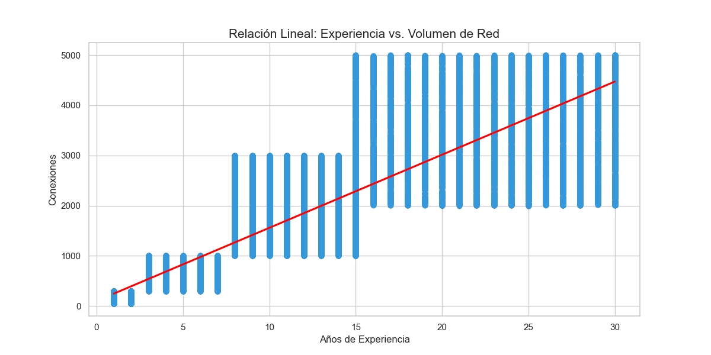
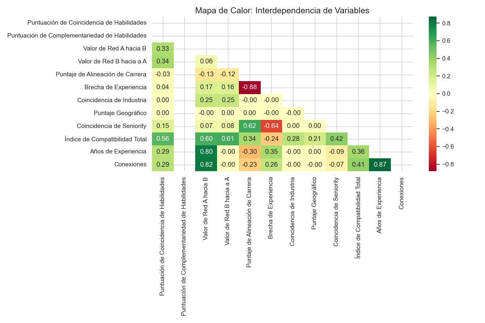

#LinkedIn Professional Compatibility & Connectivity Analysis

 Los datos se han extraído de: https://www.kaggle.com/datasets/likithagedipudi/linkedin-compatibility-dataset-50k-profiles

Este proyecto presenta un Análisis Exploratorio de Datos (EDA) avanzado y un pipeline de Ingeniería de Datos aplicado a un dataset de redes profesionales de LinkedIn. El objetivo es desglosar las métricas de compatibilidad entre usuarios para identificar patrones de networking, brechas de habilidades y oportunidades estratégicas de mentoría, culminando en un entorno de visualización interactivo en Power BI.

#### 📊 Especificaciones Técnicas y Origen
Los datos han sido obtenidos del LinkedIn Compatibility Dataset (50k profiles). Utilizando los archivos CSV que aparecen en el link ( compatibility_pairs.csv & profiles.csv)

Entidades Únicas: 50,000 perfiles biográficos.

Registros de Interacción: 200,000 filas (pares de compatibilidad).

Dimensiones Finales: 34 columnas tras el proceso de unificación y limpieza.

#### 📂 Evolución y Gestión de Archivos
A lo largo del proyecto, los datos han transitado por distintas etapas de madurez para garantizar la trazabilidad y la integridad de la información:

compatibility_pairs.csv: archivo original de 1.1GB de tamaño que contiene millones de datos para corroborar con profiles.csv
profiles.csv: Dataset original con la información biográfica bruta de 50,000 usuarios.

muestra_eda.csv: Registro de 200,000 interacciones y métricas de compatibilidad entre pares de perfiles, creado a partir de compatibility_pairs.csv
df = pd.read_csv('compatibility_pairs.csv')

df_muestra = df.sample(n=200000, random_state=42)

df_muestra.to_csv('muestra_eda.csv', index=False)

dataset_analisis_final.csv: Producto de la unión (Inner Join) de las fuentes originales (muestra_EDA.csv y profiles.csv) y la primera fase de limpieza de nulos y estandarización. Versión utilizada para el Análisis Exploratorio de Datos (EDA) en VS Code, con columnas renombradas a español profesional.

dataset_final_powerbi.csv: Archivo definitivo optimizado con ingeniería de variables, redondeos estadísticos y codificación UTF-8-SIG para una visualización perfecta en Power BI.

## 🛠️ Metodología de Procesamiento
#### 1. Integración de Datos (Data Merging)
El corazón del análisis reside en la naturaleza relacional del dataset. Se unificaron dos fuentes principales:

profiles.csv: Contiene el ADN profesional (educación, industria, experiencia).

muestra_eda.csv: Registra las métricas de afinidad (scores) entre pares de usuarios.

Se ejecutó un Inner Join utilizando profile_a_id como llave relacional. Este proceso transforma una lista estática de perfiles en una red dinámica de interacciones profesionales.

#### 2. Pipeline de Limpieza y Refinamiento (ETL)
Se implementó un pipeline robusto en Python (Pandas) diseñado para la optimización en Power BI:

Normalización Textual: Estandarización de nombres e industrias a formato Title Case para una estética profesional en reportes.

Desestructuración de Listas: Uso de expresiones regulares (Regex) para limpiar columnas como skills y goals, que originalmente contenían formatos de lista de Python (['Skill1', 'Skill2']), convirtiéndolas en texto plano delimitado.

Imputación de Nulos: Los valores faltantes en "Años de Experiencia" se trataron con la mediana para evitar sesgos por outliers, mientras que las categorías vacías se normalizaron como "Not Specified".

Ingeniería de Características: * Estado/Provincia: Extracción mediante funciones lambda del campo de ubicación.

Cantidad_Habilidades: Nueva métrica numérica para cuantificar la versatilidad del perfil.

Rango de Experiencia: Segmentación categórica (Junior, Mid, Senior, Executive).

Antes de crear el archivo dataset_analisis.csv lo que se hizo fue traducir las columnas para una mejor interpretación de los gráficos y de cara a facilitar el tratamiento de los datos en Power BI

    'skill_match_score': 'Puntuación de Coincidencia de Habilidades',

    'skill_complementarity_score': 'Puntuación de Complementariedad de Habilidades',

    'network_value_a_to_b': 'Valor de Red A hacia B',

    'network_value_b_to_a': 'Valor de Red B hacia a A',

    'career_alignment_score': 'Puntaje de Alineación de Carrera',

    'experience_gap': 'Brecha de Experiencia',

    'industry_match': 'Coincidencia de Industria',

    'geographic_score': 'Puntaje Geográfico',

    'seniority_match': 'Coincidencia de Seniority',

    'compatibility_score': 'Índice de Compatibilidad Total',

    'mutual_benefit_explanation': 'Explicación de Beneficio Mutuo',

    'pair_id': 'ID de Pareja',

    'profile_a_id': 'ID de Perfil A',

    'profile_b_id': 'ID de Perfil B',

    'email': 'Correo Electrónico',

    'headline': 'Titular Profesional',

    'about': 'Extracto / Acerca de',

    'current_role': 'Cargo Actual',

    'experience': 'Historial de Experiencia',

    'education': 'Educación / Formación',

    'source': 'Fuente de Origen',

    'name': 'Nombre Completo',

    'industry': 'Industria',

    'location': 'Ubicación',

    'current_company': 'Empresa Actual',

    'seniority_level': 'Nivel de Seniority',

    'years_experience': 'Años de Experiencia',

    'skills': 'Habilidades Técnicas',

    'goals': 'Objetivos Profesionales',

    'needs': 'Necesidades de Networking',

    'can_offer': 'Propuesta de Valor',

    'remote_preference': 'Modalidad de Trabajo',

    'connections': 'Conexiones',

    'exp_range' : 'Rango de Experiencia'

### ⚠️ Nota de Integridad: El Fenómeno de Duplicidad Relacional
Es crucial entender que el dataset presenta nombres repetidos (ej. "David Smith"). Esto no representa un error de carga, sino que responde a:

Naturaleza Relacional: Un usuario único aparece múltiples veces porque se evalúa su compatibilidad con diferentes perfiles. Cada fila es una relación, no un registro de identidad.

Homónimos Reales: En una muestra de 50,000 personas, existen IDs únicos distintos para nombres idénticos.

Recomendación: En Power BI, utilice siempre DISTINCTCOUNT sobre profile_id para métricas de volumen poblacional.

## 📈 Análisis Exploratorio (EDA) y Visualizaciones Críticas
#### A. Distribución de Densidad (KDE)
Al observar la compatibilidad, se detectó una media de 36.66 frente a una mediana de 35.80. El ligero sesgo a la derecha indica que, aunque la mayoría de las conexiones son de afinidad media, existe un grupo selecto de "parejas profesionales perfectas" (Score > 50) que actúan como el motor de la red.

#### B. Relación Lineal (Experiencia vs. Red)
Se validó la hipótesis: "A mayor experiencia, mayor capital social".

Correlación: 0.87.

Hitos: Se observan "escalones" de crecimiento a los 2, 7 y 15 años.

Saturación: La red tiende a estabilizarse al alcanzar las 5,000 conexiones, punto crítico para identificar a los Top Connectors.

#### C. Variabilidad por Seniority (Boxplots)
El análisis de cajas revela que la compatibilidad no es estática:

Entry a Senior: El índice medio sube consistentemente.

Nivel Executive: Presenta la mayor dispersión, indicando que en la alta dirección, la compatibilidad es de nicho: altamente exitosa o nula.

#### D. Mapa de Calor (Interdependencia)
El hallazgo más técnico confirma que la compatibilidad total está impulsada por el Valor de Red (0.60) y las Habilidades (0.56), mientras que el Puntaje Geográfico (0.21) es el factor menos relevante.

Insight: En este ecosistema, lo que sabes pesa tres veces más que dónde vives.

## 💻 Código de Generación del Dataset Final
Este script en Python consolida todas las transformaciones anteriores para generar el archivo listo para producción del POWER BI.
import pandas as pd
import numpy as np

### Cargar dataset tras la unión inicial

df = pd.read_csv('dataset_analisis_final.csv')

 #### 1. Ingeniería de Ubicación

df['Estado_Provincia'] = df['Ubicación'].apply(
    lambda x: x.split(',')[-1].strip() if ',' in str(x) else 'No Especificado'
)

 #### 2. Refinamiento de Habilidades y Conteo
'
df['Habilidades Técnicas'] = df['Habilidades Técnicas'].astype(str).str.replace(r"[\[\]']", "", regex=True).str.strip()

df['Cantidad_Habilidades'] = df['Habilidades Técnicas'].apply(
    lambda x: len(x.split(',')) if x != 'nan' and x != '' else 0
)

#### 3. Normalización Numérica y Tipos

cols_score = [

    'Puntuación de Coincidencia de Habilidades', 

    'Puntuación de Complementariedad de Habilidades',

    'Puntaje de Alineación de Carrera',

    'Índice de Compatibilidad Total',

    'Puntaje Geográfico'

]
df[cols_score] = df[cols_score].round(2)

df['Conexiones'] = df['Conexiones'].fillna(0).astype(int)

#### 4. Exportación Final para Power BI

df.to_csv('dataset_final_powerbi.csv', index=False, encoding='utf-8-sig')

## 🚀 Conclusiones Finales
Crecimiento Orgánico: El networking es una función acumulativa de la trayectoria profesional (Corr 0.87).

Estructura Equilibrada: El dataset presenta una uniformidad industrial (Consultoría, Finanzas, Salud, etc.), lo que otorga validez universal a las métricas de compatibilidad.

Potencial de Mentoría: El alto score en Complementariedad de Habilidades valida que el dataset es un terreno fértil para identificar mentores expertos para perfiles Entry con habilidades específicas.

Aquí tienes la sección de "Próximos Pasos" diseñada específicamente para ser integrada en tu archivo README.md. Esta sección explica cómo evolucionar el proyecto desde un análisis descriptivo hacia una herramienta de inteligencia de negocios avanzada dentro de Power BI.

## 🚀 Próximos Pasos: Evolución y Escalabilidad en Power BI
Para transformar este análisis estático en una herramienta de soporte de decisiones dinámica, se proponen las siguientes líneas de desarrollo futuro dentro del entorno de Business Intelligence:

#### 1. Implementación de Inteligencia DAX (Data Analysis Expressions)
El objetivo es transicionar de columnas estáticas a cálculos dinámicos que respondan a la interacción del usuario en tiempo real:

KPIs Dinámicos: Desarrollar medidas para calcular el Índice de Compatibilidad Total promedio según filtros de industria, nivel de seniority o región geográfica.

Rankings de Talento (Top N): Implementar funciones de ranking para identificar automáticamente a los perfiles con mayor potencial de "match" dentro de segmentos específicos de la red.

Ratios de Especialización: Crear métricas que relacionen la Cantidad de Habilidades con la experiencia para identificar perfiles altamente versátiles en sectores de nicho.

#### 2. Análisis de Escenarios mediante Parámetros "What-If"
Habilitar la capacidad de simulación para que el usuario pueda ajustar el peso de las variables en el score final:

Simulador de Prioridades: Permitir que el reclutador ajuste mediante deslizadores (sliders) qué factor es más relevante (ej. dar 80% de peso a Habilidades y 20% a Geografía) y ver cómo se reconfigura el mapa de compatibilidad instantáneamente.

#### 3. Storytelling y Visualización Avanzada
Optimizar la experiencia de usuario (UX) para facilitar la extracción de hallazgos:

Análisis de Cuadrantes: Implementar gráficos de dispersión que comparen Años de Experiencia vs. Conexiones, dividiendo la visualización en cuadrantes para detectar líderes de red, mentores potenciales y talento emergente.

Tooltips Cualitativos: Integrar ventanas emergentes que muestren la Explicación de Beneficio Mutuo al pasar el cursor sobre una relación profesional, aportando el contexto que los números no muestran por sí solos.

#### 4. Automatización del Pipeline de Datos
Asegurar que el Dashboard se mantenga actualizado con el mínimo esfuerzo manual:

Integración de Scripts de Python: Configurar Power BI para ejecutar el pipeline de limpieza y transformación directamente sobre el dataset de origen (profiles.csv y muestra_eda.csv), automatizando el ETL en cada actualización del reporte.

Alertas de Datos: Configurar umbrales de rendimiento para notificar cambios significativos en las tendencias de networking o caídas en la calidad de los perfiles entrantes.

### ANEXO ( Resultados EDA)

Tras realizarse un análisis general de la información, se ha procedido a realizar un estudio ligeramente más exhaustivo de la información para ello y tras investigar en una hoja de jupyter notebook se ha decidido incluir información complementaria.

##### Análisis bivariado y segmentación
###### Experiencia y conexiones
El gráfico de regresión entre años de experiencia y conexiones muestra una correlación positiva clara. A mayor experiencia, mayor es el volumen de la red (conexiones). Esto valida la premisa de que la red profesional crece con el tiempo.

###### Impacto de la brecha de experiencia.
El análisis de la brecha de experiencia ( diferencia de años entre los perfiles) es crucial: 

-La similitud en la experiencia se asocia con una mediana de compabitibilidad más alta. A medida que la brecha aunmenta, la mediana de compatibilidad tiende a disminuir. Esto sugiere que los pares con trayectorias profesionales similares tienen más facilidad para encontrar puntos en común.

##### Compatibilidad por modalidad de trabajo
- El análisis por modalidad de trabajo revela que, si bien la mediana de compatibilidad es similar entre onsite, hybrid y remote; la modalidad onsite presenta una mayor variabilidad y los outliers de mayor puntuación. 

#### Análisis cualitativo

Los análisis de frecuencia de las columnas de texto revelan:

- Una fuerte inclinación hacia perfiles tecnológicos con una base de programación fundamental y enfoque en análisis de datos ( programación C, data science, numpy...)

- Equilibrio entre el deseo de maestría técnica y ambición de liderazgo ( palabras como specialize, learn new skills, executive position...)

- Los perfiles buscan activamente orientación y oportunidades ( carrer guidance, business advice, hiring...)

- Conclusión cualitativa: la red de perfiles analizada funciona como un ecosistema de apoyo donde los perfiles con experiencia ofrecen mentoring y referencias de contratación mientras que los perfiles en crecimiento buscan oportunidades y orientación profesional.

